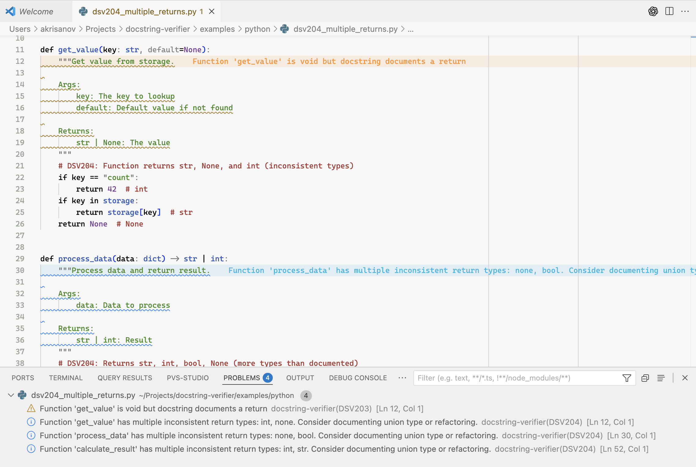

# Docstring Verifier

[](https://github.com/akrisanov/docstring-verifier/actions/workflows/ci.yml)
[](https://github.com/akrisanov/docstring-verifier/actions/workflows/codeql.yml)
[](https://codecov.io/gh/akrisanov/docstring-verifier)

## Project Goal

Build a VS Code extension that detects discrepancies between docstrings and actual code implementations, highlighting errors and suggesting corrections.

## Success Criteria for CodeSpeak

- Opens Python file → plugin highlights parameter mismatch
- Diagnostics + Quick Fix → auto-generates correct docstring
- Multi-language support (Python + TypeScript) showing architecture extensibility

The implementation plan can be found in [MVP.md](./docs/MVP.md).

Sneak peek of the extension prototype in action:



## Limitations

- Python only supports Google and Sphinx docstring formats (not NumPy)
- Basic type checking (doesn't handle complex generics or custom types)
- Side effects detection is primitive (file I/O, print, globals only)
- TypeScript support doesn't cover all JSDoc tags
- No integration with type checkers (mypy, pyright)

## Architecture

Simple high-level flow:

```text
┌──────────────┐
│  VS Code     │  User edits Python/TypeScript file
│  Editor      │
└──────┬───────┘
       │
       ▼
┌──────────────┐
│  Language    │  Extract function signature + body
│  Parser      │  (Python AST / TS Compiler API)
└──────┬───────┘
       │
       ▼
┌──────────────┐
│  Docstring   │  Parse Args/Returns/Raises
│  Parser      │  (Google/Sphinx/JSDoc)
└──────┬───────┘
       │
       ▼
┌──────────────┐
│  Analyzers   │  Compare code facts vs docstring
│              │  → Find mismatches
└──────┬───────┘
       │
       ├─────────────────┐
       ▼                 ▼
┌──────────────┐  ┌──────────────┐
│ Diagnostics  │  │ Code Actions │
│ (Red lines)  │  │ (Quick Fix)  │
└──────────────┘  └──────────────┘
```

**Key Features:**

- **5 Return Validation Rules**: Type mismatch, Missing documentation, Void functions, Multiple returns, Generator yields
- **4 Parameter Validation Rules**: Missing in code/docstring, Type mismatch, Optional mismatch
- **2 Exception Validation Rules**: Missing documentation, Documented but not raised
- **Multi-language**: Python (Google/Sphinx) + TypeScript (JSDoc)
- **Generator Support**: Detects yield statements and validates Yields vs Returns sections
- **Diagnostic Codes**: DSV101-401 for filtering
- **Quick Fixes**: Auto-generate corrected docstrings

For detailed architecture, see [Design.md](./docs/Design.md).

## Technical Stack

- **Language:** TypeScript
- **Framework:** VS Code Extension API
- **Python Parsing:** Python `ast` module (via child_process)
- **TypeScript Parsing:** TypeScript Compiler API
- **Testing:** Mocha + @vscode/test-electron
- **Build:** esbuild
- **Package Manager:** pnpm
- **CI/CD:** GitHub Actions
- **Linting:** ESLint + Prettier
- **Coverage:** Istanbul (lcov) → Codecov

## Development

### Running Tests

```bash
# Run tests without coverage
pnpm run test

# Run tests with coverage
pnpm run test:coverage

# Validate coverage report
pnpm run test:validate-coverage
```

### Coverage Reports

Coverage reports are automatically generated and uploaded to [Codecov](https://codecov.io/gh/akrisanov/docstring-verifier).

---

(C) MIT, Andrey Krisanov 2025
