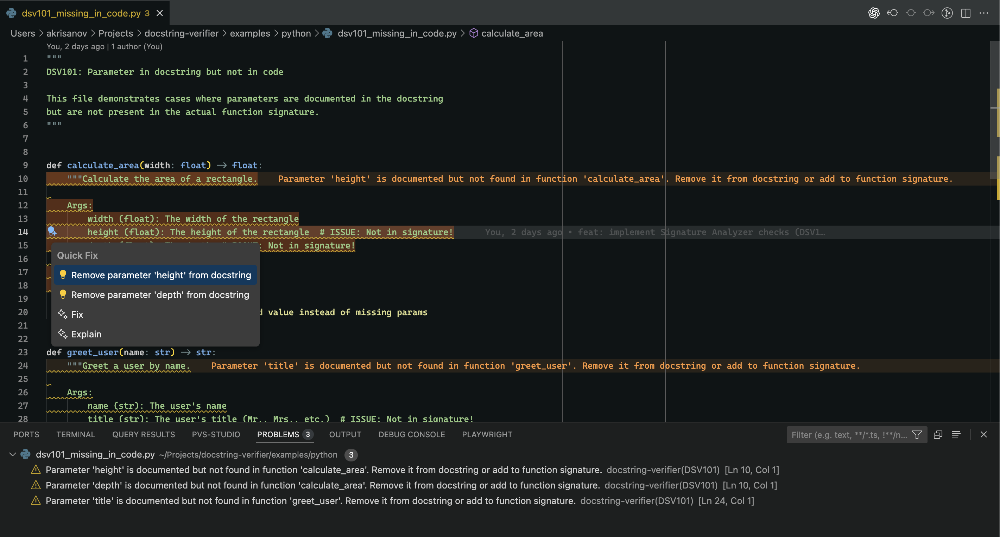

# Docstring Verifier

[](https://github.com/akrisanov/docstring-verifier/actions/workflows/ci.yml)
[](https://github.com/akrisanov/docstring-verifier/actions/workflows/codeql.yml)
[](https://codecov.io/gh/akrisanov/docstring-verifier)

## Project Goal

Build a VS Code extension that detects discrepancies between docstrings and actual code implementations, highlighting errors and suggesting corrections.

## Success Criteria for CodeSpeak

- Opens Python file → plugin highlights parameter mismatch
- Diagnostics + Quick Fix → auto-generates correct docstring
- Multi-language support (Python + TypeScript) showing architecture extensibility

The implementation plan can be found in [MVP.md](./docs/MVP.md).

Sneak peek of the extension prototype in action:



## Limitations

- Python only supports Google and Sphinx docstring formats (not NumPy-style)
- Basic type checking (doesn't handle complex generics or custom types)
- TypeScript/JavaScript support not yet implemented (architecture ready)
- Quick Fixes: Parameter fixes (DSV101-104) complete; Return and Exception fixes in progress
- No integration with type checkers (mypy, pyright)
- Sphinx editor not yet implemented (only Google editor available)

## Architecture

Simple high-level flow:

```text
┌──────────────┐
│  VS Code     │  User edits Python/TypeScript file
│  Editor      │
└──────┬───────┘
       │
       ▼
┌──────────────┐
│  Language    │  Extract function signature + body
│  Parser      │  (Python AST / TS Compiler API)
└──────┬───────┘
       │
       ▼
┌──────────────┐
│  Docstring   │  Parse Args/Returns/Raises
│  Parser      │  (Google/Sphinx/JSDoc)
└──────┬───────┘
       │
       ▼
┌──────────────┐
│  Analyzers   │  Compare code facts vs docstring
│              │  → Find mismatches
└──────┬───────┘
       │
       ├─────────────────┐
       ▼                 ▼
┌──────────────┐  ┌──────────────┐
│ Diagnostics  │  │ Code Actions │
│ (Red lines)  │  │ (Quick Fix)  │
└──────────────┘  └──────────────┘
```

**Key Features:**

- **5 Return Validation Rules**: Type mismatch, Missing documentation, Void functions, Multiple returns, Generator yields
- **4 Parameter Validation Rules**: Missing in code/docstring, Type mismatch, Optional mismatch
- **2 Exception Validation Rules**: Missing documentation, Documented but not raised
- **1 Side Effects Rule**: Detects undocumented I/O, print statements, global modifications
- **Quick Fixes**: Automated fixes for parameter mismatches (DSV101-104) with surgical edits
- **Docstring Styles**: Supports both Google-style and Sphinx-style docstrings
- **Auto-detection**: Automatically detects Google vs Sphinx docstring style per file
- **Surgical Docstring Editor**: GoogleDocstringEditor for precise, non-destructive edits
- **Multi-language Ready**: Python (Google/Sphinx) implemented, TypeScript architecture ready
- **Generator Support**: Detects yield statements and validates Yields vs Returns sections
- **Diagnostic Codes**: DSV101-401 for filtering and identification
- **Performance Optimized**: Caching, sampling, and async processing for fast analysis

For detailed architecture, see [Design.md](./docs/Design.md).

## Configuration

The extension works out of the box with sensible defaults. All settings can be configured via:

- VS Code UI: **Preferences → Settings** → Search for "Docstring Verifier"
- VS Code JSON: **Preferences → Settings (JSON)** → Add `docstringVerifier.*` keys

### Quick Start

No configuration needed! The extension will:

- Auto-detect your Python interpreter
- Auto-detect docstring style (Google/Sphinx)
- Use AI (GitHub Copilot) for smart descriptions

### Common Settings

```jsonc
{
  // Enable/disable the extension (default: true)
  "docstringVerifier.enable": true,

  // Use AI for generating descriptions in Quick Fixes (default: true)
  // Requires GitHub Copilot extension
  "docstringVerifier.useLLM": true,

  // Docstring style: "auto" (detect), "google", or "sphinx" (default: "auto")
  "docstringVerifier.docstringStyle": "auto",

  // Logging level: "error", "warn", "info", "debug", "trace" (default: "info")
  "docstringVerifier.logLevel": "info"
}
```

### Advanced Settings

```jsonc
{
  // Custom Python interpreter (default: "" = auto-detect)
  "docstringVerifier.pythonPath": "/usr/local/bin/python3",

  // Prefer uv for faster Python execution (default: true)
  "docstringVerifier.preferUv": true,

  // LLM timeout in milliseconds, 1000-30000 (default: 5000)
  "docstringVerifier.llmTimeout": 5000,

  // LLM provider (default: "github-copilot")
  // Currently only GitHub Copilot is supported
  "docstringVerifier.llmProvider": "github-copilot"
}
```

### AI-Powered Descriptions

When **Quick Fixes** add missing parameters, returns, or exceptions, the extension can use AI to generate smart descriptions instead of "TODO" placeholders.

**Requirements:**

- Install [GitHub Copilot](https://marketplace.visualstudio.com/items?itemName=GitHub.copilot) extension
- Set `"docstringVerifier.useLLM": true` (enabled by default)

**How it works:**

1. Click Quick Fix → parameter is added instantly with "TODO: Add description"
2. AI generates description in the background (typically 1-3 seconds)
3. "TODO" is automatically replaced with the AI-generated text
4. Future requests for the same parameter reuse cached descriptions

### Troubleshooting

**Extension not working?**

- Check Python is installed: `python --version` or `python3 --version`
- Try setting `pythonPath` explicitly in settings
- Set `"docstringVerifier.logLevel": "debug"` to see detailed logs in Output panel

**AI descriptions not working?**

- Verify GitHub Copilot is installed and activated
- Check `"docstringVerifier.useLLM": true` in settings
- Try increasing timeout: `"docstringVerifier.llmTimeout": 10000`

**Slow performance?**

- Enable `"docstringVerifier.preferUv": true` (requires [uv](https://github.com/astral-sh/uv))
- Reduce logging: `"docstringVerifier.logLevel": "warn"`

## Technical Stack

- **Language:** TypeScript
- **Framework:** VS Code Extension API
- **Python Parsing:** Python `ast` module (via child_process)
- **TypeScript Parsing:** TypeScript Compiler API
- **Testing:** Mocha + @vscode/test-electron
- **Build:** esbuild
- **Package Manager:** pnpm
- **CI/CD:** GitHub Actions
- **Linting:** ESLint + Prettier
- **Coverage:** Istanbul (lcov) → Codecov

## Development

### Running Tests

```bash
# Run tests without coverage
pnpm run test

# Run tests with coverage
pnpm run test:coverage

# Validate coverage report
pnpm run test:validate-coverage
```

### Coverage Reports

Coverage reports are automatically generated and uploaded to [Codecov](https://codecov.io/gh/akrisanov/docstring-verifier).

---

(C) MIT, Andrey Krisanov 2025
